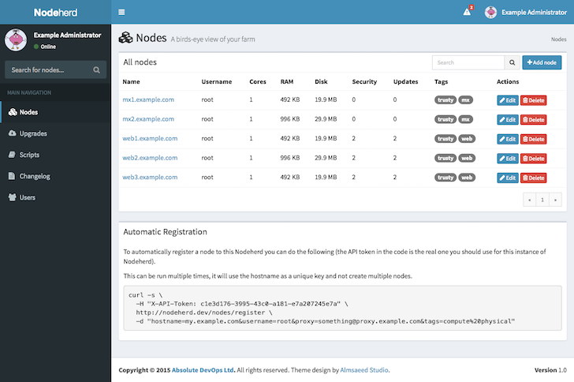
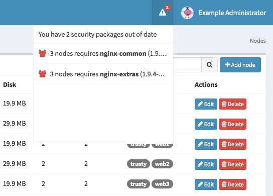
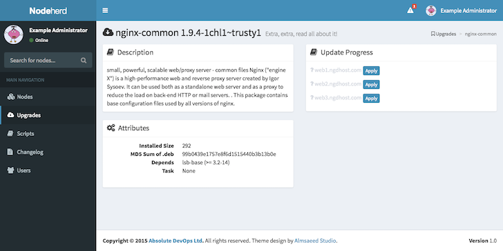
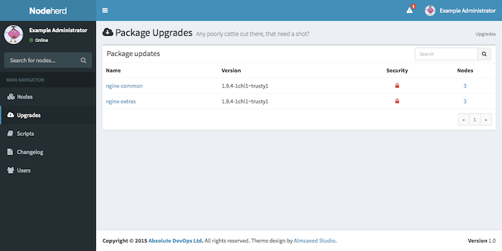
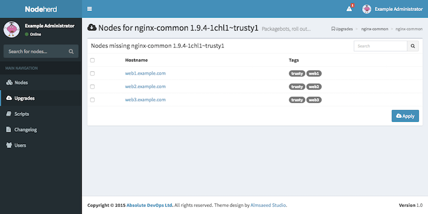
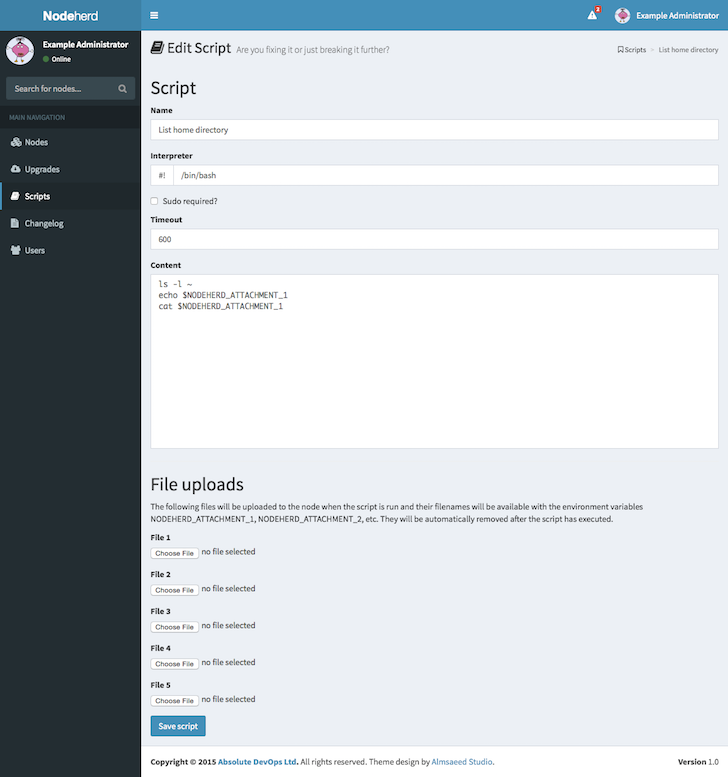

# Nodeherd

Like a Shepherd herds their sheep, a Nodeherd watches over their little electronic beasties...



## Introduction

Absolute Devops Ltd are working on a new cloud product for the UK and wanted something to manage package updates across our platform's nodes. 

We couldn't find any open-source projects to do this in a nice way (some people do it with Chef/Puppet, others have a collection of shell scripts). We also considered paid products such as [Canonical's Landscape](https://landscape.canonical.com/), but we found that they didn't really fit with the way we wanted to do things.  So we wrote Nodeherd and have decided to release it as open-source.

This application came to life as Nodeherd and is watching our fledgling farm of servers as it grows ready for launch.  Nodeherd is written in Ruby on Rails, so it should be easy enough for anyone used to Rails to install.

At this point the instructions below are for experienced Rails developers to be able to get Nodeherd up and running.  We are assuming you know how to host a Rails application, e.g. using [Phusion Passenger](https://www.phusionpassenger.com/), and we won't be covering that part of it.  If you have any questions though, you're welcome to get in touch with us via open-source@absolutedevops.io or by using Issues here.

## Installation

1) The first step is to clone the repo and set it up with Passenger (or Unicorn or whatever you require), so that you can load the site in a browser.

2) Nodeherd requires a database and out of the box will use sqlite3.  This is an easy default choice as it works everywhere, but if you're thinking that you'll be managing a lot of nodes, we'd recommend dropping the standard `config/database.yml` and replace it with a MySQL or PostgreSQL one.

3) Nodeherd needs to know the location of a private SSH key file that it can read and will give it access to all of the machines it needs to manage.  If you are using one machine as a bounce/jump machine or bastion host, that will work fine.  To configure the key, you can either put the filename in a YAML file in `config/ssh.yml` looking like this:

```yaml
production:
  filename: "/home/nodeherd/.ssh/id_dsa"
```

Or you can define an environment variable called `NODEHERD_PRIVATE_SSH_KEY_FILENAME` using `PassEnv` or `SetEnv` from Apache's [mod_env](https://httpd.apache.org/docs/2.4/mod/mod_env.html).  Finally, if neither of these are in use, Nodeherd will look for a file called `.ssh/id_dsa` within it's home directory.

4) All of the machines that Nodeherd can access, must have the ability to use passwordless sudo, at least for `apt-get` to be able to perform package management.  For random scripts that you choose to run, these can on a per-script basis be chosen to run with/without sudo. **TODO**: It uploads them to /tmp by default, this won't work on machines running noexec on /tmp for security

5) There are two rake tasks that should be run from a cron job on a regular (daily or 4-hourly as a guess) basis.  The first updates the hardware for all nodes (including those just added) - `RAILS_ENV=production bundle exec rake update:hardware`.  The other task `RAILS_ENV=production bundle exec rake update:packages` connects to each server and effectively runs `apt-get update` then downloads a list of packages to be applied, including determining which are for security fixes.

6) There's also a long running task which should be executed using something like [run-one-constantly](http://manpages.ubuntu.com/manpages/saucy/man1/run-one.1.html) - `RAILS_ENV=production bundle exec rake actions:run`.  This uses a database table for the queue (which helps to keep a track of what has happened to a node), so there's no need for any additional queuing software.


## Operation

### Adding nodes

You can add nodes, using the simple "Add node" button on the homepage of Nodeherd.  This will give you a simple form to fill out.  If you leave the name or FQDN blank it will use the other, but you must give it one.  All the other fields should be self-explanatory.

As the information says at the bottom of the node listing, you can also use a simple [curl](http://curl.haxx.se/) command to register nodes automatically.  Each installation of Nodeherd will automatically generate a unique token which will persist with the installation.

### Tagging and searching

Tagging is a way of grouping nodes to be able to apply actions to them.  Nodes are automatically tagged with the Ubuntu release if available and with the first part of the FQDN (excluding any digits), so an Ubuntu 14.04 machine called `web1.example.com` would be tagged with `web` and `trusty`.

You can also manually apply tags when adding a new node, or afterwards by clicking on the Node's hostname, typing the name of a tag and clicking the plus/delete button.  If you want to remove a tag, just do the same thing (the button will add or remove them depending on if they're present).

You can then get a filtered list of nodes by searching with either part of the hostname (e.g. "example.com") or by typing `tag:web`.  This search works for the search box in the left navigation, the Nodes listing page or the Upgrades and Scripts pages.

### Package updates

When there is an update to be applied it will be shown as a notification symbol in the top right corner:



You can click the package to view more information about the package:



This can then be applied to any of the nodes, individually just by clicking the "Apply" button alongside each node it's applicable to.  If you view the list of Upgrades from the left side menu you can see a list of packages that need upgrading:



If you click the number of nodes from the right hand side of that listing, you can check boxes to apply that upgrade to multiple nodes at the same time:



### Random scripts

There may be times when you want run a random script across a number of nodes.  This is done from the Packages side menu.  You can create a script, which will be run on a selection of nodes.  It can also upload up to 5 files alongside the script and the filenames of those files will be available in the script as environment variables.



## Copyright and acknowledgements

This software was written and is copyright by Absolute DevOps Ltd, all rights reserved.  However, it's released as Open Source software under the [MIT licence](http://opensource.org/licenses/MIT). The theme is also licensed under the MIT licence and is available from [Almsaeed Studio](https://almsaeedstudio.com).